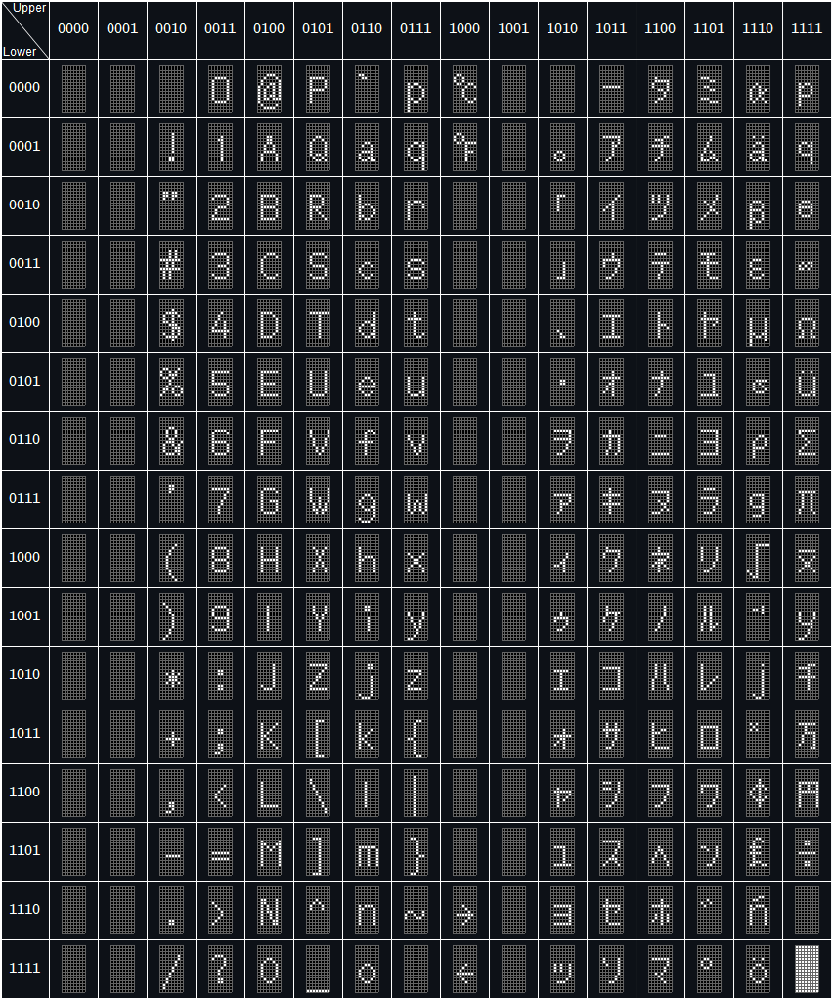

# ssd1306

[Raspberry Pi](https://ja.wikipedia.org/wiki/Raspberry_Pi) で
SSD1306 ( や SH1106 ) を [LCD1602](https://www.google.com/search?q=LCD1602) のように気軽に使うためのモジュールです.

<picture>
  
</picture>

長い間, いわゆる「LCD1602」と呼ばれている 16桁 x 2行の I2C 接続 LCD 表示器を使ってきたのですが,
ちょっとした連続運転を実施した際に思ったのが,

「まぶしいな、こいつ。」

でした.
LCD の文字を浮かび上がらせるバックライトの光量がやたら豊かなんですね.
ここでふと思いついたのが,

「[OLED](https://ja.wikipedia.org/wiki/有機エレクトロルミネッセンス) の表示器なら,
背景が光るのではなくて文字が光るので, 光量は抑えられるのではないか。」

という発想です.
以前にも使用実績があるので,
[「OLED ディスプレイ」で検索](https://www.google.com/search?q=OLED+ディスプレイ)してみたところ,
期待していた文字表示ではなく, グラフィック表示の製品がやたら出てきました.
( 検索を間違えてました.
[秋月さんとこ](https://akizukidenshi.com/catalog/default.aspx)で検索すべきだったのです. ) 

いずれも SSD1306 というコントローラーを使用した製品のようですが,
検索結果によると, どうもみなさん arduino 推しのようです.
たまに Raspberry Pi Pico での使用例もありましたが,
「おおきい Raspberry Pi」( Linux ベースの Raspberry Pi ) での使用例がなかなか見当たりません.
そんな状況を見て,

「I2C 接続なら Raspberry Pi OS 上でも動かせるはずだ。」

とか思って一つ二つ取り寄せて,
Raspberry Pi OS ( bookworm ) 上で動かす算段を始めた, というのが経緯です.

## 内容

ソースの主役は表題の `ssd1306` ですが,
その下敷きとなっている `i2c` や,
`ssd1306` の使用例としてのおまけアプリ `status` というのも添えてあります.
全てを落っことして `make` して, `./status` を起動すると, 冒頭の写真のように文字列が表示されます.

これらソースのラインナップは:

| ファイル名 | 役割 |
| --- | --- |
| [`ssd1306`](docs/ssd1306.md)	| SSD1306 ( や SH1106 ) を LCD1602 のように使うためのモジュール |
| [`i2c`](docs/i2c.md)		| SSD1306 ( や SH1106 ) を接続するための汎用 I2C モジュール |
| [`status`](docs/status.md)	| `ssd1306` はこんな風に使ってくださいね的なサンプル |
| `Makefile`			| 普通に makefile |

となっております. ( それぞれの説明は上記ファイル名のリンクをつついてください. )

申し遅れましたが, C 言語で記述しております.
C++ や Python ではありません.
 

( 右記 Languages にそこそこ C++ が計上されているのは, おまけの Windows ツールの分です. )

 
上記ラインナップだけで完結しており,
他のモジュールやライブラリは使っていません.
必要な全てがこの中に書かれています.

## 文字

純然たるグラフィックス表示器 ( のコントローラーである SSD1306 ) を LCD1602 のように使うということは,
文字パターン, LCD1602 業界風に言えばキャラジェネ ( CG ) を, ソフトに持たせるということになります.

自前で作りました.
Windows&reg;からフォントパターンをパクってくるような, 著作権違反な行為はしておりません.
 
しておりませんが, Windows&reg;上の主だった等幅フォントが 8x16pix の空間でどう描かれているのかは調査しました.
 
その結果:

* 行間を確保するため, 上 4pix は空けておく.
* ベースラインとして, 下 3pix は空けておく. 小文字の `g`, `j`, `p`, `q`, `y` はこの空間にはみ出す.
* 囲み記号 `(`, `)`, `[`, `]`, `{`, `}`や `/`, `\`, `|` は上下の空間を大きく使う.
* 原則, 左右 1pix ずつ空けておく.

というルールが見えてきました.
実質 6x9pix 程度ということになりますが, その縛りで作ってみました.
 
その結果が下の表です. ( LCD1602 業界風データシート的表記 )

これだけ小さいとデザイン性もへったくれもありません.
「このpix 数じゃこうとしか表現できないだろ」という文字が大半です.
著作権を主張する気にもなれません.
フリーとしておきますので,
パクるなりモジるなり好きにしてください.

デザイン性はありませんが, ポリシーとしては

* [セリフ](https://ja.wikipedia.org/wiki/セリフ_(文字))は付けない

としておきました.
そんな余地はないという事情と,
[Courier](https://ja.wikipedia.org/wiki/Courier_(書体)) のパクりに見えそうという懸念からです.
等幅フォントでは, セリフで空いた空間を埋め, 文字と文字の間がスカスカに見えるのを防ぐのが一般的でしょうが,
まあ, それは気にしないことにしました.

キャラクターセットとしては,
ほぼ全ての「LCD1602製品」に搭載されている LCD コントローラーの元祖である日立さんの
[HD44780](https://en.wikipedia.org/wiki/Hitachi_HD44780_LCD_controller) に敬意を表し,
カナや記号まで含めて ( ROM Code: A00 に ) 極力合わせました.

ただし, 元祖では `→` と `←` がコード `0x7e` と `0x7f` に配置されていて,
ASCII の `0x7e` である `~` が表示できないので,
`0x7e` を ASCII 通り `~` に割り当て,
`→` と `←` は `0x8e` と `0x8f` に引っ越してもらいました.
あと, こちらの勝手で `0x80` と `0x81` に &#x2103; と &#x2109; を入れています.

## 名前

`ssd1306` とか銘打っている割には, SSD1306 の持つ機能を全部使いこなしているわけではありません
( グラフィックス描画のサポートとか, スクロール機能とか ).
LCD1602 のマネしかしていないので,
`ssd1602` とか銘打とうかとも考えたのですが,
LCD1604 のマネもできているし,
フォントさえ作れば LCD0802 とか LCD0401 とかもマネできます.
余計に「名は体を表す」でなくなるので,
すなおに `ssd1306` と名付けた次第です.

## 速度

キャラクターコードを送るだけで済む LCD1602 と異なり,
フォントのビットマップを送らなければならない分,
動作速度は LCD1602 に劣ります.
ビットマップ転送なんて重い仕事を I2C なんて遅いインターフェイスでやっているからですね.

Raspberry Pi の I2C のボーレートは, デフォルトで 100kbps ですが,
これをいじって描画速度の違いを見てみました.
 

( Raspberry Pi 4 Model B Rev 1.4 調べ )

`sudo vi /boot/firmware/config.txt`
して( bookworm の場合 )
`dtparam=i2c_baudrate=400000`
とか書き加えて, `reboot` するだけで実施できますし.

| 速度 | 感じ |
| --- | --- |
| 100kbps ( Standard mode ) `dtparam=i2c_baudrate=100000`|上から下にザラっと描画されるのがよく判る感じ.|
| 400kbps ( Fast mode ) `dtparam=i2c_baudrate=400000`|よーく見ると上から下に描画されているのがなんとなく判る感じ.|
|1Mbps ( Fast mode plus ) `dtparam=i2c_baudrate=1000000`|パッと描画されている感じ.|
|3.4Mbps ( High-speed mode ) `dtparam=i2c_baudrate=3400000`|パッと描画されている感じ.|

あれー?
なんで 3.4Mbps で動くんだろう?
SSD1306 のデータシートによると,
I2C のクロックの最低周期 tcycle は 2.5[&#0181;s] となっていて,
逆数は 400,000 [Hz].
いかにもな Fast mode 狙いに見えるけど,
定格の記載が慎重なのかな?

## 結論

結局, この計画の中でいちばん時間を食ったのはフォントの作成でした.
( まあ, そうなるだろうと事前に予想はしていましたが. )
そのための[ツール](docs/Fontab.md)も作りました.
その[ソース](src/Fontab/)もいちおう置いておきましたので,
興味のある方は拾ってみるのも一興かと存じます.

元祖 LCD1602 に比べて遅いのですが,
そこは仕様上の配慮とか駆動系の工夫とかで実用上は補えると思います.

元祖 LCD1602 に比べて「まぶしくない」表示ができて,
ちょっぴり文字もきれいに出せました.

外形的に薄く仕上がるのもメリットですかね.
買った表示器が小さいので表示も小さくなるのですが,
文字がくっきり見えるので, これはこれでアリという感想です.

1000円もしない投資でしばらく遊べたことは認めます.

&nbsp;

In-house Tool / 家中 徹

