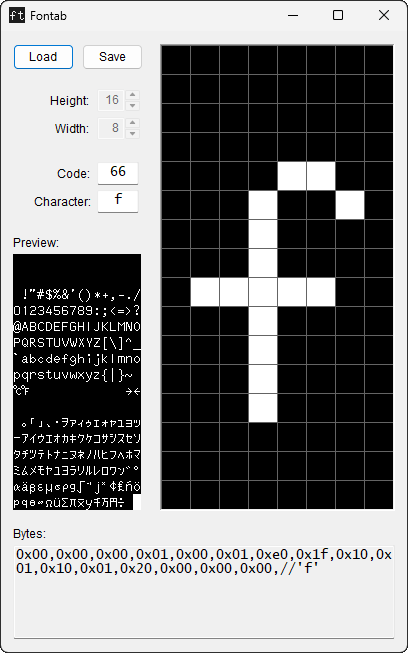

# `Fontab`

[`ssd1306`](ssd1306.md) 用フォント作成ツール.



画面に出ているのは, 右側が見ての通りフォントのビットマップとして,<br>
左側は下に向けて以下のようなものが並んでいます.

| 名前 | 役割 |
| --- | --- |
| `Load` ボタン | 押すとフォントデータをセーブしたファイルを開きます. |
| `Save` ボタン | 編集の終わったフォントデータをファイルにしまいます. |
| `Height:` | フォントの pixel 高を指定します. |
| `Width:` | フォントの pixel 幅を指定します. |
| `Code:` | 右に出すフォントのキャラクターコードを指定します. |
| `Character:` | 右に出すフォントのキャラクターを文字で指定します. |
| `Preview:` | 全キャラクターの実寸大を表示します. |
| `Bytes:` | 編集中の文字の [`ssd1306`](ssd1306.md) 用データ配列を示します. |

で, 右側のビットマップをマウスでポチポチやると,
フォントパターンがいじれるわけです.<br>
ひとポチするたびに pixel が反転します.


## つかいかた

つかいかたもなにも, 編集する文字を選んでひたすらポチポチやるだけです.

編集する文字を選ぶには以下の手段が備わっています.

1. `Code:` にキャラクターコードの 16進数 2桁を打ち込む.
1. `Character:` に文字そのものを打ち込む. ( `\x80` といった指定も可. )
1. `Preview:` をダブルクリックすると文字一覧が出るので, 編集する文字のところをダブルクリック.
1. マウスホイールをグリグリする.

ま, いちばん簡単なのは 4. でしょうね.

編集中のビットマップばかり見つめていると,
pixel 数の少なさと[ゲシュタルト崩壊](https://ja.wikipedia.org/wiki/ゲシュタルト崩壊)で,
本質を見失いそうになります.
「実際のところどう見えるか」を `Preview:` で確認しながら編集を進めることをおススメめします.
大きなビットマップだとヘンに見えるパターンも小さく表示されると, 人の目は錯覚して案外文字だと認識するものです.

編集の済んだ文字セットは,
`Save` でファイルにしまいましょう.
で, そのファイルを USB メモリーかなにかに放り込んで,
Raspberry Pi の USB スロットに挿し,
Raspberry Pi 側は, あらかじめ

```
$ sudo mkdir /mnt/usb
```
とでもしておいたディレクトリーに
```
$ sudo mount -o uid=pi,gid=pi /dev/sda1 /mnt/usb
```
として USB を mount し,
<sub>( `uid`, `gid` はご自分のものに合わせてください )</sub>
ソースのあるディレクトリーから
```
$ cp -p /mnt/usb/fontab.c .
$ chmod 666 fontab.c
```
などとして取り込んで,
`make`
すればいいでしょう.

このツールの下側には `Bytes:` と銘打たれた欄に 16進数が並んだ表現がありますが,
この欄は read only の edit box になっているので,
マウスでぐりーっとやれば copy できます.
一文字分だけ更新したときに,
ターミナル画面上のエディタに直接 paste するのに便利でしょう.

あと, いちおう　`Height:` と `Width:` でフォントのサイズを自由に選べるように見せていますが,

* 縦 8pix で 1[page]

という SSD1306 の仕様上,

* 8 の倍数

という pixel 値を選んでおくのがいちばん現実的でしょう.
フォントの縦横の関係や SSD1306 搭載の OLED 表示器の小ささなどを考えると,
まずは 16 x 8 pix のフォントが第一の選択肢でしょう.
このツールは起動時のデフォルトで 16 x 8 pix を推してきます.

